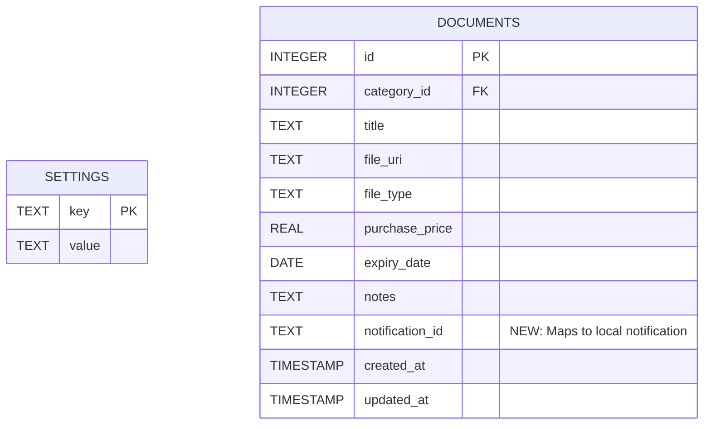
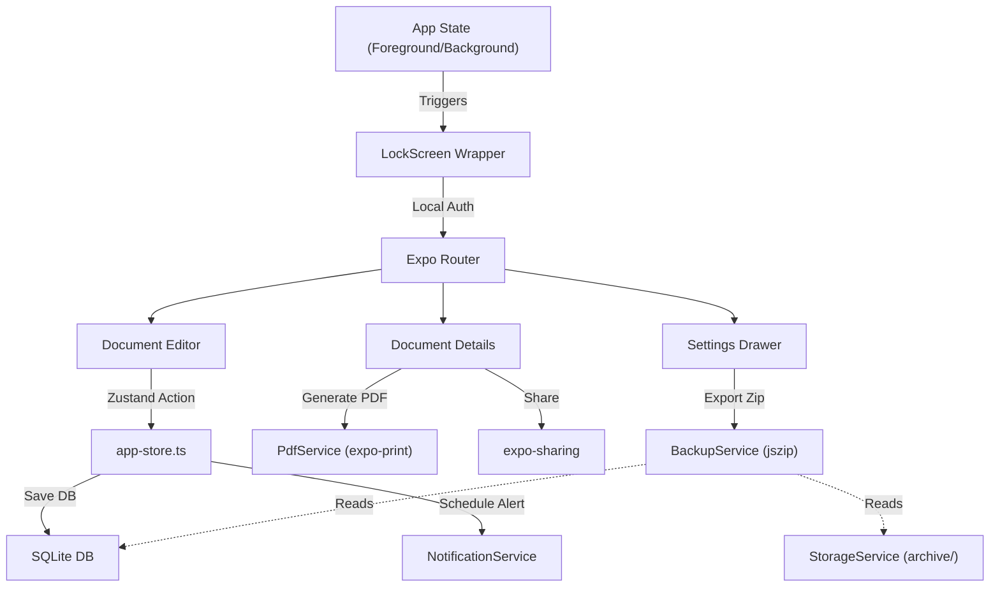

# Premium Vault Upgrade - Architecture & Roadmap

This blueprint details the transformation of our local-first Secure Document Archive into a "Premium Vault." It introduces 4 key modules: Biometric Security, Smart Notifications, PDF Export, and Data Portability (Backup & Restore). All features strictly adhere to the offline-first, zero-server cost principle.

## 1. Module Architecture & Interactions

### A. Biometric Security (`expo-local-authentication`)

- **Logic:** A full-screen `LockScreen` component wraps the app. It listens to React Native's `AppState` module. When the app moves to the `background`, it locks. When returning to the `active` state, it triggers FaceID/TouchID.
- **State:** The `app-store.ts` will gain `isUnlocked` and `biometricEnabled` states.
- **Storage:** We will introduce a key-value `settings` table in SQLite to remember user preferences across sessions.

### B. Smart Notifications (`expo-notifications`)

- **Logic:** When a document is saved with an `expiry_date`, the app calculates a warning date (e.g., 7 days prior) and schedules a local notification. 
- **State Interaction:** The Zustand store's `addDocument`, `editDocument`, and `removeDocument` actions will internally call a new `NotificationService` to schedule, update, or cancel the alert.
- **Storage:** The `documents` table will gain a `notification_id` column to keep track of the active alert tied to that document.

### C. PDF Generation Service (`expo-print`)

- **Logic:** A new `PdfService.ts` will handle transforming a Document into a shareable PDF.
- **Data Flow:** It will read the `Document`, use `StorageService` or `File` API to grab the image as a Base64 string, and inject it along with metadata (Title, Price, Date) into a styled HTML template.
- **Output:** `expo-print` renders the HTML to a PDF file, and `expo-sharing` presents the native share sheet.

### D. Data Portability (Backup & Restore)

- **Logic:** Because native zip libraries can be finicky in Expo, we will use a pure JS library like `jszip` to package the data.
- **Backup Flow:** `BackupService.ts` will locate the SQLite `.db` file (usually in the `SQLite/` directory) and iterate through the `archive/` directory via our `StorageService`. It bundles these into `VaultBackup.zip` and shares it.
- **Restore Flow:** User picks a zip file via `expo-document-picker`. The app unzips it, safely replaces the `docarchive.db` and the files in `archive/`, then triggers a Zustand state reload.

---

## 2. Updated SQLite Database Schema

```sql
-- 1. Modify the existing documents table (Requires a migration strategy)
ALTER TABLE documents ADD COLUMN notification_id TEXT;

-- 2. Create a new Settings table for Biometrics and preferences
CREATE TABLE IF NOT EXISTS settings (
    key TEXT PRIMARY KEY,
    value TEXT
);
```




---

## 3. High-Level Component Flow




---

## 4. Implementation Roadmap (Step-by-Step)

### Phase 1: Security & Settings Foundation

1. Write a DB migration to add the `settings` table and the `notification_id` column to `documents`.
2. Update `app-store.ts` to load/save settings to the DB (e.g., `{ biometricEnabled: 'true' }`).
3. Install `expo-local-authentication`. Build the `LockScreen` component that mounts at the top of the root `_layout.tsx` hierarchy.
4. Implement `AppState` listeners to auto-lock the app on minimize.

### Phase 2: PDF Export Engine

1. Install `expo-print` and `expo-sharing`.
2. Create `services/PdfService.ts` containing the HTML styling and Base64 image injection logic.
3. Add an "Export to PDF" button on the Document viewing screen, triggering the generation and sharing flow.

### Phase 3: Smart Notifications

1. Install `expo-notifications` and configure permission requests on app boot.
2. Create `services/NotificationService.ts` to handle `scheduleExpiryNotification(document)` and `cancelNotification(id)`.
3. Hook the service into the Zustand store's `addDocument`, `editDocument`, and `removeDocument` functions, saving the resulting ID back to the SQLite row.

### Phase 4: Data Portability (Backup/Restore)

1. Install a JS zip library like `jszip`.
2. Create `services/BackupService.ts`.
3. Implement `createBackupZip()`: Read the raw `.db` file and the `/archive` folder contents, zip them, and trigger `Sharing`.
4. Implement `restoreFromZip(uri)`: Clear existing db/archive, unzip contents into their respective directories, and re-initialize the DB and Zustand store.

