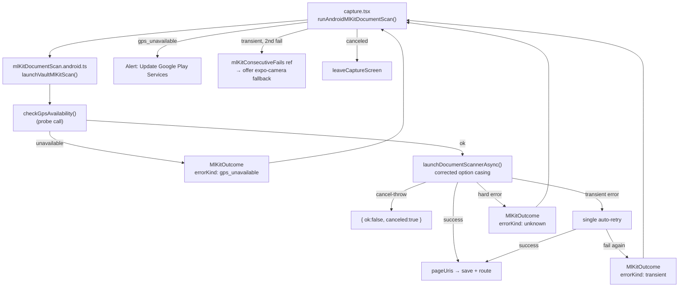

# Robust Google ML Kit Document Scanner Integration

## Root-cause analysis of "unknown error occurred"

The current `services/mlKitDocumentScan.android.ts` has three silent failure paths:

1. **Wrong option casing** — `resultFormats: 'jpeg'` and `scannerMode: 'base'` are passed lowercase. The Infinite Red bridge (`@infinitered/react-native-mlkit-document-scanner` v5) maps to Google's integer constants and may silently reject lowercase values, causing the scanner to launch in an undefined state and throw.
2. **Cancel-as-throw** — On some Google Play Services versions, user cancellation throws a native exception instead of returning `{ canceled: true }`. The current `catch` block surfaces this as "Document scanner failed."
3. **No error classification** — All errors (Google Play Services too old, transient failures, device incompatibility) collapse into the same generic message with no actionable path for the user.

## Architecture of the fix



## Detailed changes

### 1. `services/mlKitDocumentScan.types.ts`
Extend the failure union with a structured `errorKind`:

```typescript
export type MlKitErrorKind = 'gps_unavailable' | 'canceled_via_error' | 'transient' | 'unknown';

export type MlKitScanOutcome =
  | { ok: true; pageUris: string[] }
  | { ok: false; canceled: boolean; errorKind?: MlKitErrorKind; message?: string };
```

### 2. `services/mlKitScannerMode.ts`
Add a mapping helper to convert the internal lowercase `MlKitScannerMode` to the uppercase value the bridge expects:

```typescript
export function toNativeScannerMode(mode: MlKitScannerMode): string {
  if (mode === 'base_with_filter') return 'BASE_WITH_FILTER';
  if (mode === 'full') return 'FULL';
  return 'BASE';
}
```

### 3. `services/mlKitDocumentScan.android.ts` — core hardening

- Import `toNativeScannerMode` and pass `toNativeScannerMode(scannerMode)` in the options object.
- Change `resultFormats: 'jpeg'` → `resultFormats: 'JPEG'`.
- Add `classifyMlKitError(e: unknown): MlKitErrorKind` that inspects the error message for known GPS error codes (`ERROR_CODE_SCANNER_APP_UNAVAILABLE`, `RESULT_CANCELED`, `ApiException`, etc.) and returns the appropriate kind.
- Wrap `launchDocumentScannerAsync` in a `scanWithRetry()` helper: attempt once, if `classifyMlKitError` returns `'transient'` retry once, otherwise propagate.
- Convert `canceled_via_error` outcomes back to `{ ok: false, canceled: true }` so the UX never shows an error for a plain cancel.
- All changes stay inside this one file; the `.types.ts` extension is the only other service change.

### 4. `app/capture.tsx` — UX error handling

Add a `mlKitConsecutiveFailsRef = useRef(0)` (reset on success/cancel).

In `runAndroidMlKitDocumentScan`, after `scan.ok === false && !scan.canceled`:

- If `scan.errorKind === 'gps_unavailable'`: show an `Alert` with "Update Google Play Services" and a button that calls `Linking.openURL('market://details?id=com.google.android.gms')`.
- Otherwise: increment `mlKitConsecutiveFailsRef.current`. If `>= 2`, offer a "Use camera instead" action in the `Alert` that sets `androidMlKitDirect` override to `false` via a new local state `mlKitOverrideCamera` (so the screen falls back to the Expo Camera preview without needing a store change).
- On success or cancel: reset `mlKitConsecutiveFailsRef.current = 0`.

### 5. Free / Pro quota verification (no new code, confirm correct)

These boundaries are already enforced correctly:

- **OCR (Free):** `consumeOcrReadTrial()` gates each page; quota is checked in `handleFinishMultiPageUnsafe` and single-page path.
- **OCR (Pro):** unlimited — `isPro` bypasses trial consumption.
- **Multi-copy / multi-page PDF (Pro only):** `multiPageMode` is gated behind `isPro` in `toggleMultiPageMode` and reset to `false` when `isPro` turns false (see `useEffect` at line 150 of `capture.tsx`). The plan confirms no additional gating is required.

### 6. Crop / Save / Multi-photo integration (confirm correct)

ML Kit's own scanner UI provides edge detection, perspective correction, and crop — no additional code is needed. The post-scan save paths are:

- **Single page** → `saveFileToArchive(uri)` → `router.replace('/document/[id]')` with `fileType: 'image'`
- **Multiple pages** → `handleFinishMultiPageUnsafe()` → `createPdfFromImages()` → `saveFileToArchive()` → `router.replace('/document/[id]')` with `fileType: 'pdf'`

Both paths survive the hardening changes because `launchVaultMlKitScan` returns `{ ok: true, pageUris }` only when pages are valid, unchanged from current behavior.

## Files to edit

- [`services/mlKitDocumentScan.types.ts`](services/mlKitDocumentScan.types.ts) — add `MlKitErrorKind`, extend failure union
- [`services/mlKitScannerMode.ts`](services/mlKitScannerMode.ts) — add `toNativeScannerMode()`
- [`services/mlKitDocumentScan.android.ts`](services/mlKitDocumentScan.android.ts) — fix option casing, add error classification, retry wrapper, cancel-as-throw mapping
- [`app/capture.tsx`](app/capture.tsx) — consecutive-fail counter, GPS error prompt with Play Store link, expo-camera fallback state

## Native rebuild requirement

No new native dependencies. `@infinitered/react-native-mlkit-document-scanner` is already in `package.json` and linked. After these JS-only changes, an OTA update (`eas update`) is sufficient — no `expo run:android` rebuild needed.