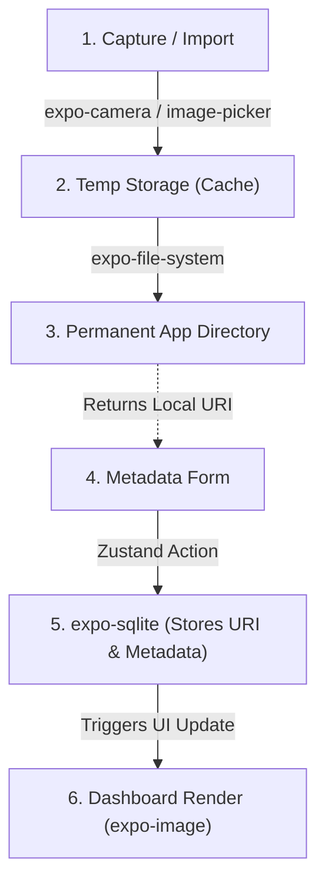
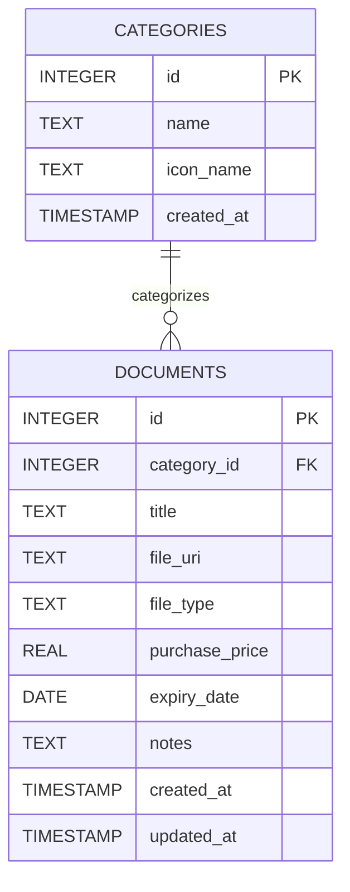

# Secure Document Archive - Pivot Architecture

This blueprint outlines the strategic pivot from a text-based "Prompt Library" to an offline-first, media-heavy "Secure Document Archive". By leveraging the existing React Native, Expo Router, SQLite, and Zustand foundation, we can rapidly build a premium app tailored for users suffering from subscription fatigue.

## 1. Optimal Data Flow (Offline-First)

To keep the application fast and avoid bloating the SQLite database, binary files (images/PDFs) will never be stored directly in the database. Instead, we use a hybrid approach:

1.  **Capture**: User scans a receipt via `expo-camera` or imports a file via `expo-image-picker`/`expo-document-picker`.
2.  **File System**: The app moves the file from the temporary cache to a dedicated, permanent local directory (e.g., `FileSystem.documentDirectory + 'archive/'`).
3.  **Database**: The permanent `file_uri` is saved to `expo-sqlite` alongside user-entered metadata (Purchase Price, Expiry Date, etc.).
4.  **UI**: The app renders the document using `expo-image`, reading directly from the local URI for maximum performance.

## 2. Updated SQLite Database Schema

We will adapt the existing `CATEGORIES` table and migrate the `PROMPTS` table into a new `DOCUMENTS` table.

*Note: `file_uri` acts as the critical bridge between the SQLite metadata and the physical file stored on the device via `expo-file-system`.*

## 3. Recommended Expo Libraries

To achieve the "Offline-First" vision while maintaining a lightweight app:

*   **`expo-camera`**: For the core document scanning experience.
*   **`expo-file-system`**: Essential for securely moving and managing files in the device's permanent local storage.
*   **`expo-image`**: Crucial for rendering large images (receipts/warranties) quickly without UI stutter, thanks to its superior caching mechanism compared to the standard React Native `<Image>`.
*   **`expo-image-picker` & `expo-document-picker`**: To allow users to import existing photos or PDFs.
*   **`expo-sharing`**: To allow users to export/share their saved documents easily.
*   **`expo-notifications` (Future-proof)**: For scheduling local on-device alerts (e.g., "Warranty expires in 7 days") without needing a backend server.

## 4. Transition Roadmap

### Phase 1: Foundation & Schema Pivot
*   Install new media dependencies (`expo-camera`, `expo-file-system`, `expo-image`, etc.).
*   Write an SQLite migration script to drop the old `PROMPTS` table and create the new `DOCUMENTS` table.
*   Update the existing Zustand store to handle Document state instead of Prompt state.
*   Seed the database with default categories: *Receipts, Warranties, IDs, Contracts*.

### Phase 2: Storage & Capture Engine
*   Create a `StorageService` utility using `expo-file-system` to handle saving, deleting, and retrieving files securely.
*   Build the Camera Screen to capture documents.
*   Implement the import flow for existing images and PDFs.

### Phase 3: UI Adaptation & Metadata
*   Adapt the existing dark-mode UI for the new domain. Update the Drawer navigation to filter by Document categories.
*   Build the Document Editor form, adding specialized input fields for `expiry_date` (Date picker) and `purchase_price` (Numeric input).
*   Refactor the main dashboard into a grid or list view displaying document thumbnails using `expo-image`.

### Phase 4: Polish & Premium Features
*   Implement advanced local search and filtering (e.g., sort by expiry date, filter by price).
*   Integrate local notifications for expiring warranties/IDs.
*   Add export functionality using `expo-sharing`.