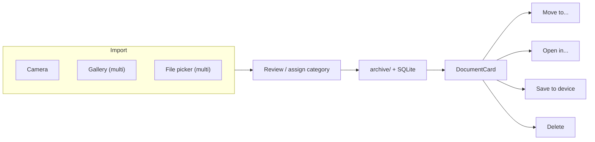
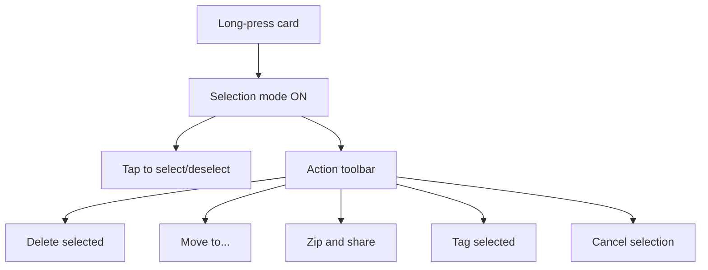

# Vault File Management — Phased Plan

## Current state (baseline)

- **Import:** Single file at a time (camera, image picker, document picker — images + PDF only).
- **Organization:** Flat categories with icons; search by title/notes. No tags, no hierarchy.
- **Document ops:** Edit metadata + category (= move), share via share sheet, export as PDF, delete from card only.
- **Bulk:** None. No multi-select anywhere.
- **Storage:** Files in `archive/` via StorageService; metadata in SQLite. Backup already zips DB + archive.

Key files:

- [app/capture.tsx](app/capture.tsx) — import flow
- [app/document/[id].tsx](app/document/[id].tsx) — document editor / viewer
- [app/(drawer)/index.tsx](app/(drawer)/index.tsx) — dashboard (FlatList)
- [components/document/DocumentCard.tsx](components/document/DocumentCard.tsx) — card actions
- [components/layout/CustomDrawerContent.tsx](components/layout/CustomDrawerContent.tsx) — drawer, categories, search
- [store/app-store.ts](store/app-store.ts) — Zustand store
- [db/documents.ts](db/documents.ts) — document CRUD
- [db/categories.ts](db/categories.ts) — category CRUD
- [services/StorageService.ts](services/StorageService.ts) — file I/O
- [services/BackupService.ts](services/BackupService.ts) — zip backup/restore

---

## Out of scope (all phases)

- Browsing arbitrary device directories.
- Managing files outside the vault.
- Encryption at rest (separate effort).
- Cloud sync / backend.
- New file types beyond images and PDF (can be revisited later).

---

## Phase 1 — Stronger import and basic vault operations

**Goal:** Multi-file import, delete from editor, explicit move, and "open in" feel.

### 1a. Multi-file import

- **Image picker:** `expo-image-picker` `launchImageLibraryAsync` supports `allowsMultipleSelection: true`. Enable it; loop through results, call `saveFileToArchive` for each, then navigate to a "review added files" step or batch-assign category.
- **Document picker:** `expo-document-picker` supports `multiple: true` on Android (SDK 54). Enable it for PDFs. On iOS multi-select may not be available; fall back gracefully to single pick.
- **UI:** On the capture/import tab, make "Pick files" and "Take photo" equally prominent (two large cards or buttons). After multi-pick, show a confirmation list ("3 files selected") with a single category picker and "Add all" action.
- **Pro gate:** Each file counts toward the free limit; check `getTotalFileCount()` before and after.

### 1b. Delete from document editor

- Add a "Delete" button (danger style) at the bottom of [app/document/[id].tsx](app/document/[id].tsx), reusing the existing `removeDocument` store action and `deleteFileFromArchive`.

### 1c. Explicit "Move to category" action

- On `DocumentCard` and in the document editor, add a "Move to..." action that opens a category picker modal and calls `editDocument` with the new `categoryId`. This is functionally the same as editing the category field, but presented as a first-class "Move" verb.

### 1d. "Open in another app" / "Save to device"

- Add an "Open in..." action to `DocumentCard` and the document editor.
- Use `expo-sharing` `shareAsync` with `dialogTitle: 'Open with...'` (Android) or `IntentLauncher` / Linking to let the OS open the file in a suitable app.
- Add "Save to device" using `expo-file-system` `StorageAccessFramework.createFileAsync` (Android) or share sheet (iOS) to let the user place a copy outside the vault.




---

## Phase 2 — Tags and enhanced organization

**Goal:** Users can tag documents and filter by tag; the vault feels organized.

### 2a. Tags data model

- New SQLite table:

```sql
CREATE TABLE IF NOT EXISTS tags (
  id INTEGER PRIMARY KEY AUTOINCREMENT,
  name TEXT NOT NULL UNIQUE,
  created_at TIMESTAMP DEFAULT CURRENT_TIMESTAMP
);
CREATE TABLE IF NOT EXISTS document_tags (
  document_id INTEGER NOT NULL REFERENCES documents(id) ON DELETE CASCADE,
  tag_id INTEGER NOT NULL REFERENCES tags(id) ON DELETE CASCADE,
  PRIMARY KEY (document_id, tag_id)
);
```

- New DB helpers: `createTag`, `deleteTag`, `getTagsForDocument`, `addTagToDocument`, `removeTagFromDocument`, `getDocumentsByTag`.
- Store: add `tags` state, `loadTags`, `addTag`, `removeTag`, `tagDocument`, `untagDocument`.

### 2b. Tag UI

- **Document editor:** Chip-style tag input below the category picker. Auto-suggest existing tags; create new on the fly.
- **Dashboard / drawer:** "Tags" section below categories in the drawer. Tapping a tag filters documents (like selecting a category). Combined filter (category + tag) is a bonus but not required for phase 2.
- **DocumentCard:** Show tag chips (max 2-3 visible, "+N" overflow).

### 2c. Enhanced search and filter

- Extend `searchDocuments` to also match tag names (`JOIN document_tags dt ON ... JOIN tags t ON ... WHERE t.name LIKE ...`).
- Add sort options on the dashboard header: "Newest", "Oldest", "Expiring soon", "Name A-Z". Store selected sort in Zustand (no persistence needed).

---

## Phase 3 — Bulk actions

**Goal:** Multi-select documents on the dashboard; bulk delete, move, zip/share.

### 3a. Selection mode on the dashboard

- Long-press a `DocumentCard` to enter selection mode (like most file managers).
- State: `selectionMode: boolean`, `selectedIds: Set<number>` in Zustand (transient, not persisted).
- Toolbar replaces the header: shows count, "Select all", and action buttons.

### 3b. Bulk delete

- Confirm modal ("Delete N documents?").
- Loop `removeDocument` for each; `deleteFileFromArchive` for each file.

### 3c. Bulk move

- "Move to..." opens category picker; `editDocument` each selected doc to new category.

### 3d. Bulk zip and share

- Reuse zip logic from `BackupService`: collect selected files from `archive/`, build a zip with `jszip`, write to cache, share via `expo-sharing`.
- Difference from full backup: no DB dump, just the selected files with a simple manifest (file name, title, category).

### 3e. Bulk tag

- "Tag selected" — opens tag picker; applies chosen tag(s) to all selected documents.




---

## Phase 4 — Copy (duplicate) and polish

**Goal:** Duplicate a document inside the vault; final UX polish.

### 4a. Duplicate inside vault

- "Duplicate" action on DocumentCard and editor.
- Flow: copy the physical file in `archive/` (new UUID filename), insert a new document row with same metadata + "(Copy)" suffix in title. Tags are also copied.

### 4b. UX polish

- Animated transitions for selection mode.
- Haptic feedback on long-press, bulk actions, and "move" confirmation.
- Empty states for tags ("No tags yet — add one from any document").
- Pro gating: tags are free (organizational); bulk zip/share could be Pro-only if desired (decision for product).

---

## Pro gating considerations


| Feature                     | Suggested tier                           |
| --------------------------- | ---------------------------------------- |
| Multi-file import           | Free (still counts against file limit)   |
| Tags                        | Free (encourages organization; low cost) |
| Move / delete / open-in     | Free (basic vault ops)                   |
| Bulk actions (multi-select) | Pro                                      |
| Bulk zip and share          | Pro                                      |
| Duplicate                   | Pro                                      |
| Sort options                | Free                                     |


This keeps the free tier useful and organized, while making power-user features (bulk, duplicate) a clear reason to upgrade.